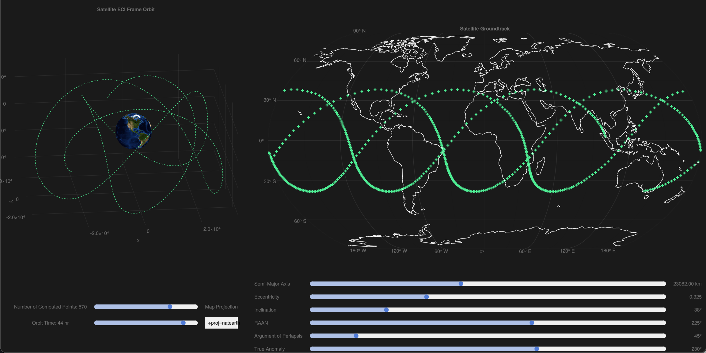

# Satellite Analysis Toolkit

A toolkit of various tools and scripts for analyzing the functioning and behaviour of artificial satellites. I am documenting my development of this package along with other work on my [personal blog](https://michaszj.github.io/starcoffee/).

A personal project building on top of [Orbit Tool](https://github.com/MichaszJ/orbit-tool) into a more fully-fledged toolkit.

Disclaimer: This is a personal project for personal use and education, I cannot guarantee the veracity of the analyses/results that you would receive if you decide to use this tool, use with caution.

## Showcase

Using [GroundTracker.jl](https://github.com/MichaszJ/satellite-analysis-toolkit/blob/main/src/GroundTracker.jl) for plotting ground-tracks and orbits of satellites:

